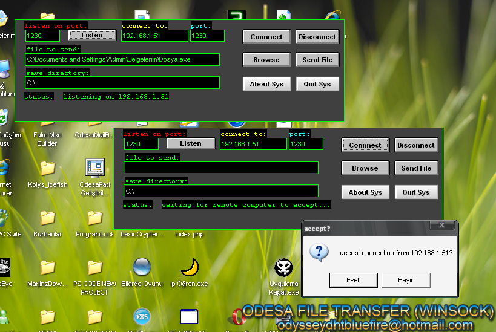



## Fast File Transfer \(Winsock\)

### Description

This code is like a winsock tutorial, it explains how to send files (of any size) to any ip using winsock.I've assumed that the reader knows only the basics of winsock...so i've explained it in.

PLEASE VOTE CODE!
 
### More Info
 
Private Declare Function PathFileExists Lib "shlwapi.dll" Alias "PathFileExistsA" (ByVal pszPath As String) As Long

Private Declare Function PathIsDirectory Lib "shlwapi.dll" Alias "PathIsDirectoryA" (ByVal pszPath As String) As Long

Elemantry Using Winsock

Boolean parameters

             |
---                |---
**Submitted On**   |2007-01-28 11:31:32
**By**             |[Alper ESKIKILI�](https://github.com/Planet-Source-Code/PSCIndex/blob/master/ByAuthor/alper-eskikili.md)
**Level**          |Advanced
**User Rating**    |4.0 (20 globes from 5 users)
**Compatibility**  |VB 5\.0, VB 6\.0
**Category**       |[Internet/ HTML](https://github.com/Planet-Source-Code/PSCIndex/blob/master/ByCategory/internet-html__1-34.md)
**World**          |[Visual Basic](https://github.com/Planet-Source-Code/PSCIndex/blob/master/ByWorld/visual-basic.md)
**Archive File**   |[Fast\_File\_2121227202008\.zip](https://github.com/Planet-Source-Code/alper-eskikili-fast-file-transfer-winsock__1-70859/archive/master.zip)

